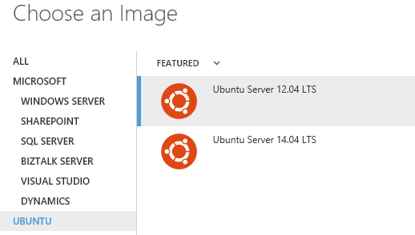

# Integración con Chef

Azure permite integrar dentro de las máquinas virtuales que se despliegan tanto Windows como Linux el cliente de Chef. Esto se realiza a traves de las [extensiones disponibles](virtualmachines-extensions.md "Extensions Máquinas Virtuales") dentro de Azure.

Únicamente será necesario contar con un servidor Chef.  Es posible realizarlo a través de los servidores Enterprise Chef disponibles como servicio o con una instalación en nuestros propios servidores. Otros servidores Chef de código abierto también son compatibles con el servicio.

Antes de realizar el despliegue de las máquinas será necesario que tengamos los dos elementos necesarios:

- **chef_server_url**: la dirección donde se aloja nuestro servidor Chef.
- **validation_client_name:**
- **clave PEM**: para la autenticación con el servidor

Las dos primeras se incluirán en el fichero **client.rb** que solicitará el asistente. A la hora de definir las recetas necesarias, Microsoft OpenTech ha publicado una serie de *cookbooks* a través de [su repositorio en GitHub.](https://github.com/chef-partners/azure-cookbook "Repositorio Microsoft OpenTech")

### Creación de una nueva máquina

Para crear una nueva máquina virtual es necesario acceder [al panel de gestión de Azure](http://manage.windowsazure.com "Panel de gestión de Azure") e iniciar la sesión. Una vez dentro, los pasos son los siguientes:

- Seleccionamos del menú  inferior la opción de **New>Compute>Virtual Machine>From Gallery**

- Dentro de la galería seleccionaremos una imagen Linux, en este caso seleccionaremos una con la última versión de **Ubuntu**.

- Completamos la configuración de la máquina virtual con el nombre, el tamaño y los datos de acceso a la misma.

- A continuación hacemos lo mismo con los detalles del servicio donde sera desplegada, la red, la cuenta de almacenamiento y los extremos que estarán disponibles.

- Tras ello, es donde tendremos que seleccionar que queremos que la máquina incluya la extensión de Chef. Esta extensión será la que instalará el cliente de Chef en su interior y le proporcionara los ficheros de información que tenemos que introducir: el **client.rb** y la **clave PEM**. El campo **Run List** nos permite especificar la receta o recetas que queremos que se ejecuten para configurar la máquina virtual. 

- Una vez completado los campos anteriores procedemos a finalizar el asistente y nuestra máquina se aprovisionara, se instalará la extensión y se le aplicarán las recetas que le hemos configurado. Tras ello, aparecerá directamente en nuestro servidor Enterprise Chef de forma similar a otras que tengamos anteriormente.

Si durante el proceso de creación de la nueva máquina virtual el portal de Azure muestra algún error será necesario consultar los ficheros de log creados por el cliente de Chef en la máquina. Estos ficheros son accesibles accediendo a la máquina virtual y consultándolos o ejecutando de nuevo de forma interactiva el cliente de Chef.

