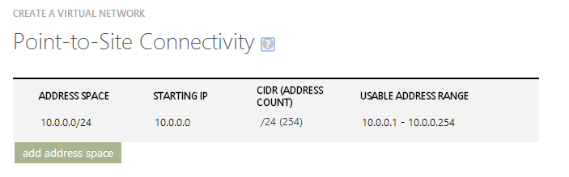
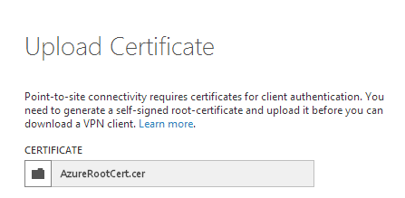

# Crear una red virtual punto a sitio

Este tipo de redes pueden ser utilizadas por ejemplo en escenario de desarrollo y pruebas donde el desarrollador necesita acceder a los recursos desplegados en Azure de una forma directa y similar a como lo haria dentro de su propia oficina. Para crear una nueva red virtual punto a sitio es necesario acceder [al panel de gestión de Azure](http://manage.windowsazure.com "Panel de gestión de Azure") e iniciar la sesión. Una vez dentro, los pasos son los siguientes:

- Seleccionamos el botón de **New** en la parte inferior izquierda de la página.

- Dentro de la nueva hoja que se despliega, buscamos la opción de **Network Services > Virtual Network** y hacemos click en **Custom Create**.

- Elegimos un nombre para nuestra red y el datacenter sobre la que la vamos a desplegar. 

- A continuación podemos definir un servidor de DNS privado. En este caso, dado que no vamos a desplegar un servidor propio dentro de la red, lo dejaremos en blanco para que emplee losde Azure. Sí que tendremos que seleccionar el checkbox de **Configure a point-to-site VPN** para continuar con el proceso.

- En este paso tenemos que seleccionar el rango de direcciones IP que queremos que usen los equipos que se conecten a través de la VPN a nuestra red privada virtual en Azure. Seleccionamos la opción por defecto de **10.0.0.0/24**.

- Ahora deberemos seleccionar seleccionar el rango de direcciones IP que queremos que use la red virtual que estará en Azure y sobre la que desplegaremos nuestras máquinas virtuales o servicios en la nube. Seleccionamos la opción por defecto de **10.0.1.0/24**. Rango situado a continuación del anterior.

- Antes de finalizar el asistente es necesario selccionar **Add Gateway Subnet**. Esta subred es necesaria para desplegar en ella el gateway que hará posible la conexión entre nuestra red virtual en Azure y los clientes de la red VPN punto a sitio que se conecten. Aceptaremos la opción por defecto.

- Tras aceptar, el proceso de creación de la nueva red llevará unos minutos. Una vez finalizado, la interfaz nos indicará que *The Gateway was not created*. Es decir, necesitamos crear el gateway que servirá de punto de conexión entre ambas redes. Para ello, únicamente necesitaremos hacer click en la opción que aparece en el menú inferior **Create Gateway**

El proceso de creación del gateway puede llevar hasta 20 o 30 minutos por lo que mientras se crea continuaremos con el siguiente paso.

#### Configuración de los certificados

La autenticación de los clientes con el gateway VPN se realiza a través de certificados.  Para ello necesitaremos dos: el primero de ellos sera un certificado X.509 root auto firmado; el segundo, un certificado cliente que necesario instalar en los equipos que vayan a acceder a la red. Para facilitar el trabajo, los certificados ya han sido creados previamente por lo que no entraremos en los detalles de cómo crearlos.

- Mientras se está creando el gateway, seleccionamos la opción de **Certificates** del menú superior.

- A continuación seleccionamos **Upload a Root certificate** y seleccionamos nuestro fichero *AzureRootCert.cer*

Con esto ya tendremos configurado la parte de Azure. Ahora únicamente será necesario configurar descargarnos el configurado adecuado para nuestr versión Windows.
