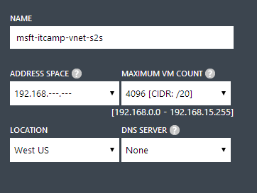

#Crear una red virtual sitio a sitio con OpenSwan

A la hora de crear una red virtual sitio a sitio es posible realizarla a traves de alguno de los dispositivos hardware soportados o utilizando algún software VPN que lo permita. En el caso de Linux, configuraremos una red virtual sitio a sitio empleando OpenSwan. Para facilitar el trabajo emplearemos una máquina virtual creada en Azure que simule nuestro equipo local. El escenario será el siguiente:

- Máquina virtual configurada con OpenSwan que se conecte a la red virtual en Azure.
- Red virtual desplegada en Azure habilitada para conexiones sitio a sitio.
- Máquina virtual ejecutando Linux o Windows dentro de la red en Azure a la que nos conectaremos para demostrar el funcionamiento correcto de nuestra configuración.

### Creación de la máquina virtual con OpenSwan

Crearemos una nueva máquina virtual basándonos en la imagen disponible en la galería de Ubuntu 14.04. De una forma similiar lo podriamos hacer con cualquiera de las otras versiones de Linux disponibles. 

Para crear una nueva máquina virtual es necesario acceder [al panel de gestión de Azure](http://manage.windowsazure.com "Panel de gestión de Azure") e iniciar la sesión. Una vez dentro, los pasos son los siguientes:

- Seleccionamos la opción de **New** en la parte inferior izquierda y tras ello: **Compute > Virtual Machine > Quick Create**. Completando los campos para desplegar la imagen de Ubuntu Server 14.04.


- Una vez que la máquina se ha creado será necesario que abramos los puertos **500** y **4500** del protocolo **UPD** para el correcto funcionamiento del protocolo IPSec. Para ello, accedemos a la pestaña de **Endpoints** y los añadimos.


- El siguiente paso será fijarnos en las IPs que Azure le ha asignado. Sera necesario tanto la pública, accesible desde Internet; como la interna, accesible desde el datacenter. Es posible encontrarlas en la página de información de la máquina virtual.
 

 
### Configuración de la red local

Para establecer la conexión sitio a sitio será necesario configurar dentro del portal la información relacionado con la red local que tendra acceso. 

- Para ello, accedemos al menú de **Networks** y tras ello a la pestaña de **Local Networks**. Hacemos click en **Add new local network**


- Le damos el nombre de nuestra red, *OpenSwan*, y fijamos como **VPN Device IP Address** la IP pública de la máquina virtual que acabamos de crear.


  
- En el rango de direcciones de la red local incluiremos el de la dirección privadad e nuestra máquina virtual. Podemos configurar un rango /32 o uno más amplio. Sim embargo, cabe recordad que debido al modelo de seguridad de Azure no seremos capaces de enrutar hacia esas direcciones IP a no ser que alguno de nuestros servicios disponga de una en ese rango.  


### Configuración de la red sitio a sitio.

Una vez que tenemos nuestra máquina con OpenSwan y la red local necesitamos crear la red en Azure con la que estableceremos el tunel VPN. Para ello, usando el asistente rápido definimos una nueva red.

- Hacemos click en el menú de **New>Virtual Network>Quick Create** y completamos los campos que nos piden. 


 
- En unos segundos estará creada. La seleccionamos de la lista y nos dirigimos a la pestaña **Configure**


- Dentro de ella, seleccionamos la opción de **Connect to the local network** y guardamos la configuración haciendo click en **Save**. De esta forma, configuraremos los datos del gateway de la red.


- Volvemos al **Dashboard** de la red recién creada y seleccionaremos **Create Gateway>Static routing**. Mientras se crea procederemos a configurar OpenSwan.


 
### Configuración de OpenSwan.

Nos conectaremos a traves de SSH a la máquina remota recién instalada. El primer paso será hacer la instalación del software de OpenSwan. 

- Ejecutamos el siguiente comando para que el gestor de paquetes obtenga e instale el software necesario.

```bash
sudo apt-get install openswan
```

- A continuación, indicamos que **No** a la hora de utilizar certificados como método de autenticación ya que securizaremos el tunel IPSec a traves de secreto compartido. Al final el proceso de instalación podemos comprobar que este se ha realizado de forma correcta comprobando que tenemos el comando *ipsec* disponible:

```bash
which ipsec
```

- Una vez instalado procederemos a modificar el fichero de configuración. Para ello usando *vi* u otro editor lo abrimos.

```bash
sudo vi /etc/ipsec.conf
```

El contenido sera similiar al siguiente:

```bash
config setup
        protostack=netkey
        virtual_private=%v4:100.88.124.0/24
        oe=off
        # Do not set debug options to debug configuration issues!
        # plutodebug / klipsdebug = "all", "none" or a combation from below:
        # "raw crypt parsing emitting control klips pfkey natt x509 dpd private"
        # eg:
        # plutodebug="control parsing"
        # Again: only enable plutodebug or klipsdebug when asked by a developer
        #
        # enable to get logs per-peer
        # plutoopts="--perpeerlog"
        #
        # Enable core dumps (might require system changes, like ulimit -C)
        # This is required for abrtd to work properly
        # Note: incorrect SElinux policies might prevent pluto writing the core
        dumpdir=/var/run/pluto/
        #
        # NAT-TRAVERSAL support, see README.NAT-Traversal
        nat_traversal=yes
        # exclude networks used on server side by adding %v4:!a.b.c.0/24
        # It seems that T-Mobile in the US and Rogers/Fido in Canada are
        plutostderrlog=~/swan.log
        include /etc/ipsec.d/*.conf
```

Será necesario configurar la opción de *virtual_private* con la IP interna de nuestra máquina virtual. También, es posible activar los logs descomentando la opción de *plutodebug*.

Tras ello, descomentamos el apartado de **conn** para incluir los parámetros especificos necesarios para nuestra VPN.

```bash
conn vpn
        authby=secret
        auto=start
        type=tunnel
        left=100.74.238.102
        leftsubnet=100.74.238.0/24
        leftnexthop=%defaultroute
        right=23.100.15.126
        rightsubnet=192.168.0.0/20
        ike=3des-sha1-modp1024,aes128-sha1-modp1024
        esp=3des-sha1,aes128-sha1
        pfs=no
 
```

OpenSwan describe los extremos de nuestra conexión VPN como *left* y *right*. El izuqierdo se trata de la dirección IP interna de la máquina virtual configurada con OpenSwan. El derecho, la IP pública del Gateway creado por Azure. Esta dirección deberemos consultarla ya que será la que tengamos que añadir en la variable *right* para que la conexión se establezca de forma correcta. El resto de parámetros están asociados con la autenticación del túnel.

- Finalmente configuraremos la clave compartida, *Pre-Shared Key (PSK)*, disponible en el portal de Azure. Para ello modificaremos el siguiente fichero:

```bash
sudo vi /etc/ipsec.secrets
```

- Necesitamos añadir lo siguiente:
    
```bash
#include /etc/ipsec.d/*.secrets
100.74.238.102 23.100.15.126 : PSK "XXXXXXXXXXXXXXXXXXXX"
```
   Es importante mantener la sintaxis correcta para evitar errores: *IPLocal IPGateway : PSK "Clave compartida"*
   
**Nota:** Es recomendable comprobar la IP del Gateway en el portal de Azure ya que es necesario usar esa para la configuración de la conexión. En el caso de que introduzcamos la incorrecta recibiremos un error a la hora de establecer la conexión.
 
- Únicamente quedara importar la información dentro del servicio de ipsec y reiniciarlo antes de comprobar que el tunel esta configurado correctamente.

```bash
sudo ipsec secrets
sudo service ipsec restart 
sudo service ipsec status
```

Si la conexión se establece de forma correcta el último comando nos indicara que hay un túnel disponible. En el caso de que aparezca el mensaje de *"No tunnels up* será necesario revisar los pasos anteriores de configuración. Tras establecer la conexión el portal de Azure reflejará los cambios indicando a su vez el trafico de entrada y salida que fluye a través de él.

 
 
Si queremos probar que el sistema está funcionando de forma correcta podemos desplegar una nueva máquina virtual con Linux o Windows dentro de la red configurada en Azure y realizar un *Ping* desde ella hacia la máquina con OpenSwan y viceversa. La IP de esta nueva máquina creada sera la primera disponible dentro del rango que hemos seleccionado, la *192.168.0.4*

- De la máquina recién creada a la red remota

```bash
ping 100.74.238.102
```
 
- De la máquina remota a la recién creada

```bash
ping 192.168.0.4
```
 

