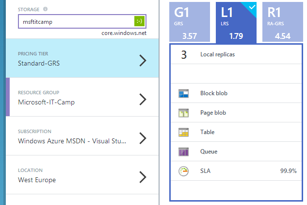
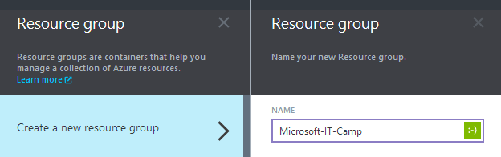

### Creación de una cuenta de almacenamiento

Para crear una nueva cuenta de almacenamiento es necesario acceder [al panel de gestión de Azure](http://portal.azure.com "Panel de gestión de Azure") e iniciar la sesión. Una vez dentro, los pasos son los siguientes:

- Seleccionamos el botón de **New** en la parte inferior izquierda de la página.

- Dentro de la nueva hoja que se despliega, buscamos la opción de **Storage** y hacemos click.

- Se nos abrirá la hoja para completar los datos necesarios para crear nuestra cuenta de almacenamiento. 

- En primer lugar, es necesario es coger un nombre de nuestra cuenta de almacenamiento. Dicho nombre tiene que ser único en el servicio ya que se nos asociará un diracción pública del formato **.core.windows.net** que emplearemos para acceder a nuestra información. Si el nombre ya esta siendo usado nos saldrá un icono de exclamación advirtiéndolo, si no, aparecerá un icono verde con una cara sonriente.
 

- El siguiente paso es elegir [el tipo de redundancia que queremos emplear](storage-redundancy.html "Redundancia Azure Storage "). En nuestro caso seleccionaremos redundancia a nivel local ya que no es necesario tener redundancia geográfica para este caso.

- Continuamos con la creación de un nuevo grupo de recursos. Los grupos de recursos nos permiten organizar de forma lógica los diferentes servicios que compongan nuestra solución dentro de Azure. Por ejemplo, para este IT Camp crearemos un grupo de recursos denominado "Linux-IT-Camp" que incluirá nuestra cuenta de almacenamiento y las máquinas virtuales que utilizaremos.

- Seleccionamos la suscripción sobre la que vamos a desplegar nuestra cuenta de almacenamiento si tenemos más de una y finalmente la región. En nuestro caso, trabajaremos con el datacenter situado en **West Europe**. Una vez completado estos pasos pulsamos en **Create**. En nuestro panel de control principal aparecerá un nuevo recuadro informándonos de que la cuenta está en proceso de creación.
 

-  Despuús de unos instantes, ya estara accesible para trabajar con ella.

