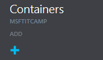

### Creación de una cuenta de almacenamiento

Para crear un nuevo contenedor dentro de nuestra cuenta de almacenamiento es necesario acceder [al panel de gestión de Azure](http://portal.azure.com "Panel de gestión de Azure") e iniciar la sesión. Una vez dentro, los pasos son los siguientes:

- Seleccionamos nuestra cuenta dentro del panel principal.

- Dentro de la nueva hoja que se despliega, seleccionamos la opción de **Containers** haciendo click.

- Se nos abrirá la hoja donde aparecerán todos los contenedores dentro de nuestra cuenta de almacenamiento. Dado que no tenemos ninguno todavia crearemos el primero. Para ello, seleccionamos la opción de **Add**

- En primer lugar, es necesario escoger un nombre para nuestro contenedor. Emplearemos el de **vhds** ya que en él almacenaremos posteriormente los discos duros de nuestras máquinas virtuales.
 

- El siguiente paso es elegir el tipo de acceso que queremos otorgar a nuestro contenedor. Existen tres disponibles. A nosotros nos interesará que sea ***Private*** ya que no queremos exponer de forma pública a traves de internet nuestros ficheros. Si esto no fuera asi, seleccionariamos el tipo de acceso ***Blob***. Por otro lado, en el caso de que además de que se pudieran acceder a los ficheros de forma independiente también se pudiera hacer un listado de los existentes dentro del contenedor, elegiríamos la opción de ***Container***

- Finalizamos el proceso y se creará nuestro contenedor dentro de la cuenta de almacenamiento. A partir de este momento podremos usarlo para almacenar contenido en él.

