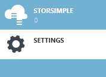
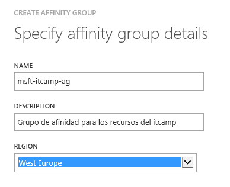

# Grupos de afinidad

A la hora de desplegar nuestras máquinas virtuales o servicios en la nube, por defecto, se realizarán a nivel de región; es decir, a uno de los datacenters disponibles a nivel global. Esto puede provocar que dos máquinas virtuales que tienen que comunicarse de forma frecuente entre ellas terminen siendo desplegadas cada una en diferentes extremos del datacenter. A pesar de las altas velocidades de transmisión dentro del datacenter, la distancia entre ambas provocará un pequeño retraso relacionado con la propogación de la información entre ambos extremos.

Aquí es donde entran en juego los grupos de afinidad. Una manera de agrupar los recursos que despleguemos dentro del datacenter para lograr un rendimiento óptimo. A la hora de crear un grupo de afinindad, estamos indicándole a Azure que cualquier servicio que despleguemos dentro de él lo coloque lo más cercano posible uno del otro. De esta manera somos capaces de reducir la latencia y aumentar el rendimiento. Los grupos de afinidad se definen a nivel de suscripción y el nombre debe de ser único. A la hora de crear un grupo de afinidad este estará atado a la región que seleccionemos. 

### Creación de un grupo de afinidad

Para crear un nuevo grupo de afinidad es necesario acceder [al panel de gestión de Azure](http://manage.windowsazure.com "Panel de gestión de Azure") e iniciar la sesión. Una vez dentro, los pasos son los siguientes:

- Seleccionamos la pestaña de **Settings** del menú lateral izquierdo

- En el menú superior seleccionamos la pestaña de **Affinity Groups**

- Tras ello, en el menú inferior seleccionamos la opción de **Add**. Necesitaremos completar el nombre del grupo de trabajo en el campo **Name**, una descripción general del uso de dicho grupo de afiniddad en el campo **Description** y finalmente seleccionar la región sobre la que queremos usarlo. Una vez aceptado estará disponible para usarlo.

