#Configurando una máquina virtual con Ubuntu y Xfce

Las imágenes disponibles de Ubuntu dentro de la galleria de Azure no vienen con el escritorio activado por defecto. En el caso de que queramos establecer una sesión interactiva de forma remota y que no sea a traves de SSH, será necesario que configuremos el escritorio. 

Para crear una nueva máquina virtual con Ubuntu es necesario acceder [al panel de gestión de Azure](http://portal.azure.com "Panel de gestión de Azure") e iniciar la sesión. Una vez dentro, los pasos son los siguientes:

- Seleccionamos el botón de **New** en la parte inferior izquierda de la página.


- Dentro de la nueva hoja que se despliega, buscamos la opción de **Ubuntu Server 14.04 LTS** y hacemos click. Es posible que haya una nueva versión disponible por lo que puede cambiar el nombre.

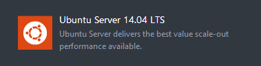

- En el siguiente paso configuraremos el nombre de la máquina virtual y el usuario que tendrá permisos de root dentro de la máquina. La autenticación se realiza a traves de un mecanismo de clave pública, será necesario que dispongas de tu clave RSA OpenSSH para configurar el acceso. Dependiendo de tu sistema operativo podras obtener una clave de una u otra forma, utiliza tu buscador preferido para encontrar la forma de hacerlo.

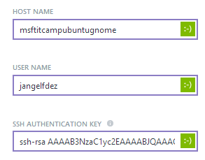

- Ahora seleccionaremos el tamaño de la máquina virtual. En este caso emplearemos la opción por defecto. Sin embargo, antes de escoger un tamaño comprueba primero las necesidades de las aplicaciones que vayas a ejecutar en ella.

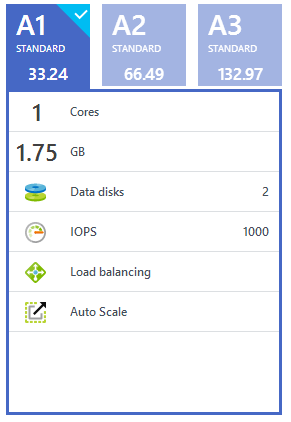

En la configuración opcional personalizaremos los campos de **Network** y **Storage Account** para emplear los que hemos creado en pasos anteriores de esta guía.

En primer lugar, configuramos la red. 

- Por defecto, el portal sugiere una basada en el nombre de nuestra máquina virtual; sin embargo, nosotros seleccionaremos la nuestra previamente creada. Para ello, seleccionamos el campo **Virtual Network** y buscamos la red *msft-itcamp-vnet* del listado de redes existentes. 

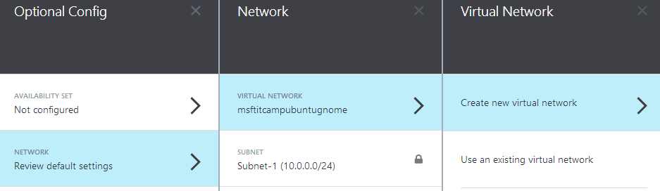

- Una vez seleccionada, nos aparecerá la primera subred seleccionada. En nuestro caso, hacemos click y en las opciones que aparecen seleccionamos la subred de *Test*. 

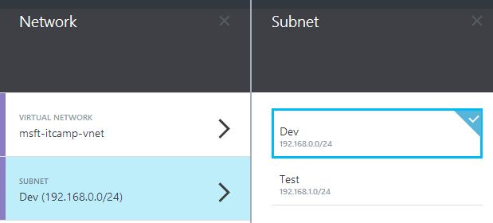

- En el último paso, necesitaremos escoger el dominio que emplearemos para poder conectarnos a nuestra máquina o publicar los servicios que ofrezca.  Por defecto, el portal sugiere uoa basada en el nombre de nuestra máquina virtual; sin embargo, nosotros seleccionaremos el nuestro propio.

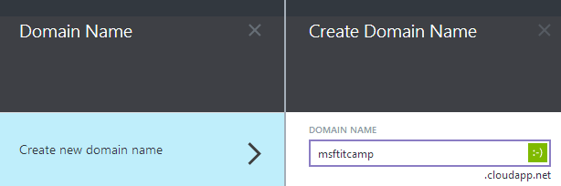

Tras estos pasos quedara configurado el apartado de red de nuestra máquina virtual.

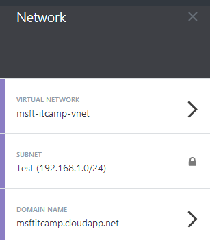

Ahora será momento de configurar el almacenamiento.

- Hacemos click la opción de **Storage Account** y del listado de cuentas existentes selecciamos la creada previamente bajo el nombre de *msftitcamp*. Tras ello, quedara configurada.

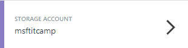

Para gestionar más fácil la máquina virtual dentro de los recursos que estamos usando en esta guía, el siguiente paso sera añadirla al grupo creado *Microsoft-IT-Camp*. Con eso, nuestra máquina quedara configurada por lo que procedemos a crearla seleccionando el botón de **Create**

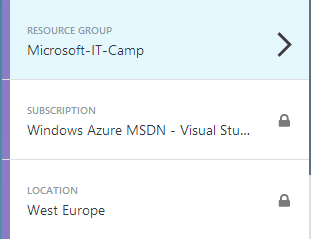

Esperaremos unos minutos a que se aprovisione la máquina y este disponible para su uso. 

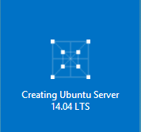

Cuando el proceso finalice se abrirá una nueva pantalla con la información de la máquina.

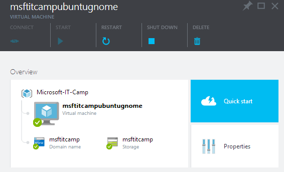

Iniciaremos sesión a traves de SSH con nuestro cliente preferido. Recuerda configurar el acceso por clave en lugar de por contraseña. Una vez que accedas tendremos la consola disponible de nuestro Ubuntu para comenzar a trabajar.

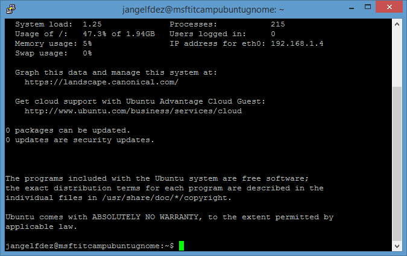


## Conectándonos a través de Remote Desktop Protocol

Por defecto, Linux no incluye soporte a conexiones RDP. Para ello, será necesario instalar el servidor *xrdp* en la máquina virtual. En las últimas versiones de GNOME existe un problema con el uso de Remote Desktop que provoca una pantalla gris sobre la que no se puede realizar ningún tipo de operación. Si deseamos tener una conexión a través de RDP será necesario utilizar una imagen 12.02 o cambiar de escritorio a XFCE. En este caso, seleccionaremos le segunda opción.

Añadimos el repositorio de xubuntu y luego actualizamos el listado de paquetes. Tras eso, instalamos el escritorio de Xfce:

```bash
sudo add-apt-repository ppa:xubuntu-dev/xfce-4.10
sudo apt-get update
sudo apt-get install xfce4 
```

El proceso tardará unos minutos mientras se descargan e instalan todos los paquetes necesarios dentro de la máquina virtual. Tras ello, ya tendremos nuestro Ubuntu con escritorio.

 
Para ello, ejecutamos el siguiente comando:

```bash
sudo apt-get install xrdp
```

Una vez instalado el paquete nos aseguramos que el servidor se ha inicializado:

```bash
sudo /etc/init.d/xrdp start
```

Crearemos un nuevo usuario para conectarnos a traves de RDP. Además del nombre de usuario te pedirá la contraseña y otra información adicional. Recuerda usar una contraseña segura ya que el servidor está expuesto a Internet. Configuraremos también la sesión por defecto del usuario y tras eso reiniciamos el servidor de *xrdp*

```bash
sudo adduser jangelfdez-rdp
echo xfce4-session>~/.xsession
sudo service xrdp restart
```

Si quieres que el usuario tenga permisos de sudo, recuerda añadirlo al grupo antes de acabar con el siguiente comando.

```bash
sudo adduser jangelfdez-rdp sudo
```

El protocolo RDP utiliza por defecto el puerto 3389; sin embargo, las máquinas virtuales Linux que se despliegan en Azure únicamente vienen con el puerto SSH activado. Para activarlo será necesario lo siguiente.

- Seleccionamos la máquina virtual en nuestro Dashboard principal.

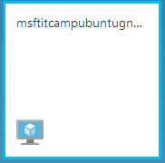

- Buscamos la opción de **Endpoints** que mostrará únicamente el puerto 22 activado y hacemos click.

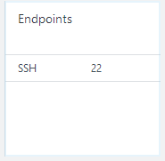

- Seleccionamos la opción de **Add** y completamos la información que nos pide con los valores de *RDP* para el campo de **Endpoint**, *3389* para el campo de **Public Port** y *3389* para el campo de **Private Port** y seleccionamos **OK**

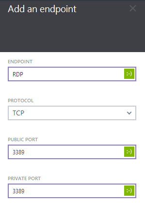

Una vez finalizado, podemos abrir directamente nuestro cliente de Remote Desktop y realizar la conexión con la máquina virtual. 

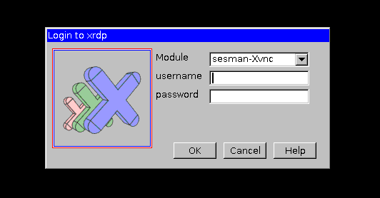

Tras introducir los datos de conexión, el escritorio estara disponible para trabajar con él.

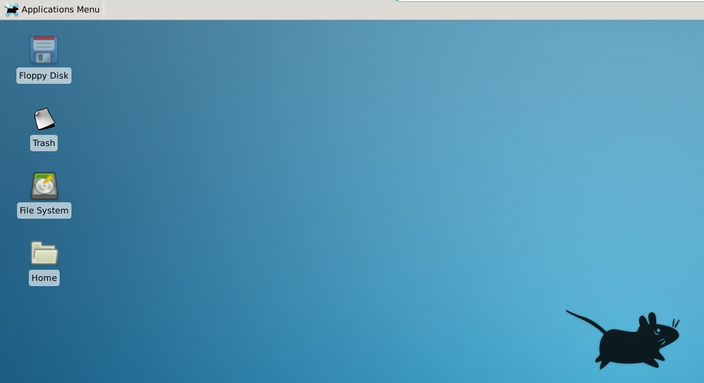


	       
